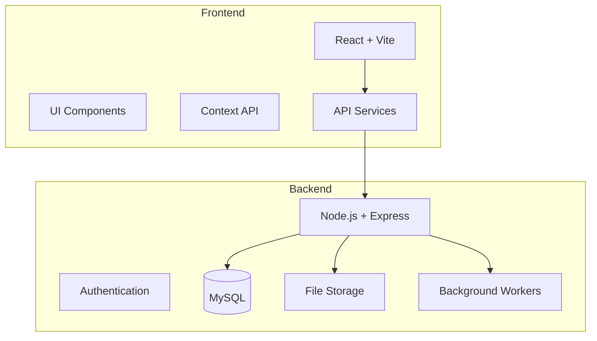

# Coral Management System

A full-stack application for managing coral inventory, orders, and client communications for coral fragment retailers.

## 🌊 Overview

The Coral Management System is a comprehensive solution designed to streamline the operations of coral fragment retailers. It provides tools for inventory management, order processing, client communication, and automated notifications.

## 🏗 Architecture



## 🚀 Quick Start

1. Clone the repository:
```bash
git clone [repository-url]
cd coral-app
```

2. Set up the backend:
```bash
cd backend
cp .env.example .env
# Update .env with your configuration
npm install
npm run seed
npm run dev
```

3. Set up the frontend:
```bash
cd frontend
cp .env.example .env
# Update .env with your configuration
npm install
npm run dev
```

The application will be available at:
- Frontend: http://localhost:5173
- Backend API: http://localhost:5000

## 💻 Tech Stack

### Frontend
- React 18 with Vite
- React Router for navigation
- Context API for state management
- CSS Modules for styling
- Axios for API communication

### Backend
- Node.js with Express
- MySQL database with Sequelize ORM
- JWT authentication
- Multer for file uploads
- Node-cron for scheduled tasks
- Nodemailer for email notifications

## 📚 Documentation

- [Frontend Documentation](./frontend/README.md)
- [Backend Documentation](./backend/README.md)
- [Deployment Guide](./backend/DEPLOYMENT.md)

## ✨ Key Features

- 🔐 Secure authentication system
- 📦 Comprehensive inventory management
- 🛒 Order processing and tracking
- 👥 Client management
- 📨 Automated notifications (Email & WhatsApp)
- 📸 Image management system
- 💾 Automated backups
- 📢 News bulletin system
- 📊 Dashboard with key metrics

## 🔧 Development Workflow

1. Create feature branch from main
2. Implement changes
3. Run tests and ensure linting passes
4. Submit pull request
5. Code review
6. Merge to main

## 📝 License

[License Type] - see the [LICENSE](LICENSE) file for details

## 👥 Contributing

1. Fork the repository
2. Create your feature branch
3. Commit your changes
4. Push to the branch
5. Create a pull request

## 🙏 Acknowledgments

- All contributors who have helped shape this project
- The coral keeping community for their valuable feedback
